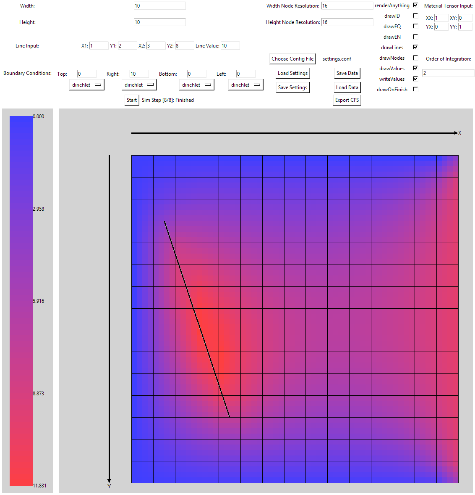

## Numerische Simulationen für DE
### Gruppe 6
Figo Tobias, Ram Abhay, Martin Thalmayr


### Installation/ Setup
#### Requirements: 
- Python (3.10 oder andere)
- Extern Verwendete packages:
  - numpy
  - scipy.linalg.spsolve (calculate.py)
  - \# not used - scikit-learn (balltree, nearest neighbor search)
  - tkinter (GUI)
  - pickle (Serialisieren/Speichern von Daten)
  - h5py (Output Writer, exportRes.py: Autor: Klaus Roppert, IGTE, 2022)
  
Example usage:
```python /src/main.py```


